#  Kasparro Agentic Facebook Performance Analyst  
**Author:** Dattatray Bodake  
**Repository:** `kasparro-agentic-fb-analyst-dattatray-bodake`  
**Version:** v1.0  

---

##  Overview

This project implements a **multi-agent system** that autonomously diagnoses Facebook Ads performance, identifies causes behind **ROAS fluctuations**, and recommends **new creative directions** using both quantitative and creative data insights.

The system simulates an **agentic marketing analyst** — capable of planning, reasoning, validating hypotheses, and generating data-driven creative recommendations.

---

##  Objectives

The system is designed to:

- Diagnose **why ROAS changed** over time.
- Identify **drivers** behind changes (e.g., audience fatigue, creative underperformance).
- Propose **new creative ideas** for low-CTR campaigns.
- Generate an **end-to-end report** summarizing analysis, insights, and recommendations.

---

##  Agentic Architecture

###  Agent Flow Diagram

```mermaid
flowchart LR
    %% Define nodes
    A([🧍 User Query: Analyze ROAS Drop]):::user --> B([🗺️ Planner Agent]):::planner
    B --> C([📊 Data Agent]):::data
    C --> D([🔍 Insight Agent]):::insight
    D --> E([🧮 Evaluator Agent]):::evaluator
    E --> F([🎨 Creative Agent]):::creative
    F --> G([📑 Report Generator]):::report
    G --> H([✅ Final Outputs: Report.md, Insights.json, Creatives.json, Logs]):::output

    %% Subgraph for clarity
    subgraph AGENTS[⚙️ Agent Workflow]
        B --> C --> D --> E --> F
    end

    %% Define classes (colors + borders)
    classDef user fill:#ffe0b2,stroke:#ef6c00,stroke-width:2px,color:#000,font-weight:bold;
    classDef planner fill:#bbdefb,stroke:#1565c0,stroke-width:2px,color:#000;
    classDef data fill:#c8e6c9,stroke:#2e7d32,stroke-width:2px,color:#000;
    classDef insight fill:#e1bee7,stroke:#6a1b9a,stroke-width:2px,color:#000;
    classDef evaluator fill:#fff59d,stroke:#fbc02d,stroke-width:2px,color:#000;
    classDef creative fill:#ffccbc,stroke:#d84315,stroke-width:2px,color:#000;
    classDef report fill:#b3e5fc,stroke:#0288d1,stroke-width:2px,color:#000;
    classDef output fill:#c5e1a5,stroke:#558b2f,stroke-width:2px,color:#000,font-weight:bold;

```



---

## Agent Descriptions

| Agent                | Role                                                                | Key Output                |
| -------------------- | ------------------------------------------------------------------- | ------------------------- |
| **Planner Agent**    | Decomposes the user query into subtasks and defines execution plan. | Task plan (JSON)          |
| **Data Agent**       | Loads and summarizes dataset (ROAS, CTR, Spend, etc.).              | `data_summary.json`       |
| **Insight Agent**    | Generates hypotheses explaining trends or drops.                    | `insights.json`           |
| **Evaluator Agent**  | Validates hypotheses quantitatively using correlations and metrics. | `evaluation_results.json` |
| **Creative Agent**   | Generates new ad creative recommendations for low-CTR campaigns.    | `creatives.json`          |
| **Report Generator** | Compiles final human-readable summary in Markdown.                  | `report.md`               |

---

## Project Structure
```bash
kasparro-agentic-fb-analyst-dattatray-bodake/
│
├── run.py                        # Main CLI entrypoint
├── Makefile                      # Make-based automation
├── run.sh                        # Optional bash runner
├── agent_graph.md                # Agent architecture & flow
├── requirements.txt               # Pinned dependencies
│
├── config/
│   └── config.yaml                # Paths, thresholds, settings
│
├── src/
│   ├── orchestrator.py            # Main orchestrator logic
│   ├── run.py
│   ├── utils/
│   │   └── config_loader.py       # Config loader helper
│   └── agents/
│       ├── planner.py
│       ├── data_agent.py
│       ├── insight_agent.py
│       ├── evaluator_agent.py
│       ├── creative_agent.py
│       └── report_generator.py
│
├── prompts/
│   └── creative_prompt.md         # Example structured LLM prompt
│
├── data/
│   ├── synthetic_fb_ads_undergarments.csv
│   └── README.md
│
├── reports/
│   ├── data_summary.json
│   ├── insights.json
│   ├── evaluation_results.json
│   ├── creatives.json
│   └── report.md
│
├── logs/
│   └── system.log        
│
└── tests/
    ├── test_full_agentic_pipeline.py   # Integration test
    ├── test_planner_agent.py
    ├── test_data_agent.py
    ├── test_insight_agent.py
    ├── test_evaluator_agent.py
    ├── test_creative_agent.py
    └── __init__.py
```

---

## Setup Instructions
1️. Clone the repository
```bash
git clone https://github.com/<your-username>/kasparro-agentic-fb-analyst-dattatray-bodake.git
cd kasparro-agentic-fb-analyst-dattatray-bodake
```

2️. Create and activate virtual environment
```
python -m venv venv
venv\Scripts\activate     # (Windows)
# or
source venv/bin/activate  # (Mac/Linux)
```

3️. Install dependencies
```
pip install -r requirements.txt
```

### Running the System
Use the CLI entrypoint:
```bash
python run.py "Analyze ROAS drop"
```
Example Output
```
=== Starting Agentic Facebook Analyst System ===
[PlannerAgent] Task breakdown generated successfully.
[DataAgent] Dataset loaded: 4500 rows, ROAS trend: decline
[InsightAgent] Hypotheses generated successfully.
[EvaluatorAgent] 3 hypotheses validated.
[CreativeAgent] 3365 underperforming creatives found.
[ReportGenerator] Report successfully generated at: reports/report.md
=== Execution Completed Successfully ===
```

---

## Testing
This project uses pytest for structured testing.

### Run all tests
```bash
pytest -v
```

### Run only unit tests
```
pytest -v -m unit
```

### Run only integration tests
```
pytest -v -m integration
```

### Or use Makefile targets
```
make test
make test-unit
make test-integration
```

---

## Makefile usage
| Command      | Description                          |
| ------------ | ------------------------------------ |
| `make setup` | Create venv and install dependencies |
| `make run`   | Run full pipeline                    |
| `make test`  | Run all tests                        |
| `make clean` | Remove reports/logs                  |

---

## Output Files
| File                              | Description                      |
| --------------------------------- | -------------------------------- |
| `reports/data_summary.json`       | Key performance metrics summary  |
| `reports/insights.json`           | Generated hypotheses             |
| `reports/evaluation_results.json` | Validation results of hypotheses |
| `reports/creatives.json`          | New ad creative suggestions      |
| `reports/report.md`               | Final summarized report          |
| `logs/system.log`                 | Structured run log (optional)    |

---

## Reflection & Observability
The system supports a reflection loop in the EvaluatorAgent, which automatically re-plans analysis if confidence falls below the configured threshold.
This ensures agents reason dynamically rather than executing a fixed sequence.

1. Configuration (from config/config.yaml):
```
thresholds:
  evaluation_confidence: 0.75
  max_reflections: 2
```

2. Example Log Excerpt (logs/pipeline.log):
```
{"timestamp": "2025-10-27T13:56:40.318942", "agent": "EvaluatorAgent", "event": "evaluation_result", "details": {"confidence": 0.62, "threshold": 0.75, "status": "below_threshold"}}
{"timestamp": "2025-10-27T13:56:40.513021", "agent": "EvaluatorAgent", "event": "reflection_triggered", "details": {"reason": "Low confidence (0.62 < 0.75)", "action": "Replanning with adjusted weights"}}
{"timestamp": "2025-10-27T13:56:41.021433", "agent": "EvaluatorAgent", "event": "reflection_completed", "details": {"new_confidence": 0.83, "reflection_attempts": 1, "status": "passed"}}
```

## Validation Logic
- Data Agent: Detects ROAS and CTR trends.
- Insight Agent: Uses structured LLM prompting (Think → Analyze → Conclude).
- Evaluator Agent: Quantitatively validates hypotheses using pandas-based metrics.
- Creative Agent: Generates improved creative ideas for underperforming campaigns.
- Report Generator: Summarizes everything into report.md.

---

## Reproducibility
- Deterministic seed values in config/config.yaml
- Pinned dependencies in requirements.txt
- Fixed sample dataset under /data
- Optional mode: sample vs. mode: full switch in config

--- 

## Future Improvements
- Add memory between runs (store insights for retraining)
- Introduce async orchestration
- Integrate Langfuse or OpenDevin for observability
- Expand creative generation with A/B simulation
