#  Kasparro Agentic Facebook Performance Analyst  
**Author:** Dattatray Bodake  
**Repository:** `kasparro-agentic-fb-analyst-dattatray-bodake`  
**Version:** v1.0  

---

##  Overview

This project implements a **multi-agent system** that autonomously diagnoses Facebook Ads performance, identifies causes behind **ROAS fluctuations**, and recommends **new creative directions** using both quantitative and creative data insights.

The system simulates an **agentic marketing analyst** — capable of planning, reasoning, validating hypotheses, and generating data-driven creative recommendations.

---

##  Objectives

The system is designed to:

- Diagnose **why ROAS changed** over time.
- Identify **drivers** behind changes (e.g., audience fatigue, creative underperformance).
- Propose **new creative ideas** for low-CTR campaigns.
- Generate an **end-to-end report** summarizing analysis, insights, and recommendations.

---

##  Agentic Architecture

###  Agent Flow Diagram

```mermaid
flowchart LR
    %% Define nodes
    A([🧍 User Query: Analyze ROAS Drop]):::user --> B([🗺️ Planner Agent]):::planner
    B --> C([📊 Data Agent]):::data
    C --> D([🔍 Insight Agent]):::insight
    D --> E([🧮 Evaluator Agent]):::evaluator
    E --> F([🎨 Creative Agent]):::creative
    F --> G([📑 Report Generator]):::report
    G --> H([✅ Final Outputs: Report.md, Insights.json, Creatives.json, Logs]):::output

    %% Subgraph for clarity
    subgraph AGENTS[⚙️ Agent Workflow]
        B --> C --> D --> E --> F
    end

    %% Define classes (colors + borders)
    classDef user fill:#ffe0b2,stroke:#ef6c00,stroke-width:2px,color:#000,font-weight:bold;
    classDef planner fill:#bbdefb,stroke:#1565c0,stroke-width:2px,color:#000;
    classDef data fill:#c8e6c9,stroke:#2e7d32,stroke-width:2px,color:#000;
    classDef insight fill:#e1bee7,stroke:#6a1b9a,stroke-width:2px,color:#000;
    classDef evaluator fill:#fff59d,stroke:#fbc02d,stroke-width:2px,color:#000;
    classDef creative fill:#ffccbc,stroke:#d84315,stroke-width:2px,color:#000;
    classDef report fill:#b3e5fc,stroke:#0288d1,stroke-width:2px,color:#000;
    classDef output fill:#c5e1a5,stroke:#558b2f,stroke-width:2px,color:#000,font-weight:bold;

```

## Agent Descriptions

| Agent                | Role                                                                | Key Output                |
| -------------------- | ------------------------------------------------------------------- | ------------------------- |
| **Planner Agent**    | Decomposes the user query into subtasks and defines execution plan. | Task plan (JSON)          |
| **Data Agent**       | Loads and summarizes dataset (ROAS, CTR, Spend, etc.).              | `data_summary.json`       |
| **Insight Agent**    | Generates hypotheses explaining trends or drops.                    | `insights.json`           |
| **Evaluator Agent**  | Validates hypotheses quantitatively using correlations and metrics. | `evaluation_results.json` |
| **Creative Agent**   | Generates new ad creative recommendations for low-CTR campaigns.    | `creatives.json`          |
| **Report Generator** | Compiles final human-readable summary in Markdown.                  | `report.md`               |

