## System Architecture Diagram

```mermaid
flowchart LR
    %% Define nodes
    A([🧍 User Query: Analyze ROAS Drop]):::user --> B([🗺️ Planner Agent]):::planner
    B --> C([📊 Data Agent]):::data
    C --> D([🔍 Insight Agent]):::insight
    D --> E([🧮 Evaluator Agent]):::evaluator
    E --> F([🎨 Creative Agent]):::creative
    F --> G([📑 Report Generator]):::report
    G --> H([✅ Final Outputs: Report.md, Insights.json, Creatives.json, Logs]):::output

    %% Subgraph for clarity
    subgraph AGENTS[⚙️ Agent Workflow]
        B --> C --> D --> E --> F
    end

    %% Define classes (colors + borders)
    classDef user fill:#ffe0b2,stroke:#ef6c00,stroke-width:2px,color:#000,font-weight:bold;
    classDef planner fill:#bbdefb,stroke:#1565c0,stroke-width:2px,color:#000;
    classDef data fill:#c8e6c9,stroke:#2e7d32,stroke-width:2px,color:#000;
    classDef insight fill:#e1bee7,stroke:#6a1b9a,stroke-width:2px,color:#000;
    classDef evaluator fill:#fff59d,stroke:#fbc02d,stroke-width:2px,color:#000;
    classDef creative fill:#ffccbc,stroke:#d84315,stroke-width:2px,color:#000;
    classDef report fill:#b3e5fc,stroke:#0288d1,stroke-width:2px,color:#000;
    classDef output fill:#c5e1a5,stroke:#558b2f,stroke-width:2px,color:#000,font-weight:bold;
```

## Agent Roles and Responsibilities

### 1. Planner Agent
- Input: User query (e.g., "Analyze ROAS drop")
- Output: Structured plan with ordered subtasks
- Responsibilities:
   - Parse user intent and decompose into actionable tasks
   - Define sequence of agent calls and expected outputs
   - Ensure reasoning flow: Think → Analyze → Conclude

### 2. Data Agent
- Input: Dataset path from config (data/synthetic_fb_ads_undergarments.csv)
- Output: Summarized data (spend, impressions, CTR, ROAS trend, etc.)
- Responsibilities:
   - Load and validate dataset integrity
   - Compute quantitative metrics over time
   - Identify outliers and trends (e.g., declining ROAS, CTR drops)

### 3. Insight Agent
- Input: Data summary from Data Agent
- Output: Hypotheses explaining performance shifts (JSON structure)
- Responsibilities:
   - Generate potential causes for ROAS decline (e.g., audience fatigue, creative burnout)
   - Apply structured LLM prompts using "Think → Analyze → Hypothesize"
   - Return hypotheses with confidence scores and rationale

### 4. Evaluator Agent
- Input: Hypotheses + summarized dataset
- Output: Validated hypotheses with quantitative evidence
- Responsibilities:
   - Validate or reject hypotheses using statistical checks (e.g., correlation between CTR and ROAS)
   - Quantify confidence of each insight
   - Produce a structured evaluation summary

### 5. Creative Agent
- Input: Evaluated hypotheses + dataset
- Output: creatives.json — recommended new headlines, CTAs, and messages
- Responsibilities:
   - Identify underperforming campaigns or creatives
   - Use validated insights to propose improved messaging ideas
   - Generate structured creative recommendations with reasoning context

### 6. Report Generator
- Input: Outputs from all previous agents
- Output: Final markdown report (reports/report.md)
- Responsibilities:
   - Combine data summaries, validated insights, and creative suggestions
   - Produce a readable, structured report for marketers
   - Ensure traceability between raw data → reasoning → recommendations

### Design Principles
- Agentic Loop: Planner → Executor → Evaluator → Reporter
- Structured Prompts: Each LLM call follows a JSON or Markdown schema
- Traceable Outputs: Every step logs structured artifacts in reports/ and logs/
- Configurable: All paths, thresholds, and model parameters in config/config.yaml
- Reproducible: Deterministic seeds and small synthetic dataset ensure consistent evaluation
